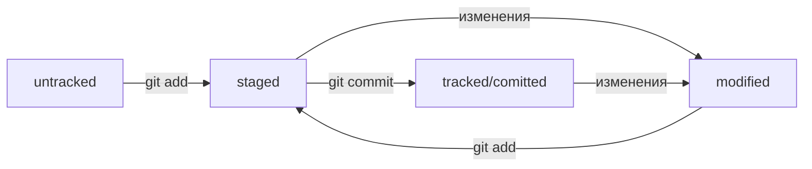

## Шпаргалка по Git

---

* Система контроля версий, или VCS (SCM), — программа, позволяющая контролировать изменения в проекте.
* Git — один из примеров системы контроля версий: он позволяет хранить, изменять и анализировать историю проекта.
* Git — незаменимый в команде инструмент, ведь он помогает объединять результаты работы нескольких человек.

---

### Инициализция

* Инициализировать репозиторий можно с помощью команды _git init_
* Проверить статус, или состояние, репозитория поможет команда _git status_
* Если вы ошиблись и случайно инициализировали не ту папку, можно «разгитить» её — удалить скрытую подпапку **.git**

### Добавление файлов

* Команда _git add_ позволяет подготовить файл к сохранению.
* Команда _git add --all_ подготовит к сохранению сразу все файлы.
* С помощью _git add ._ можно добавить в репозиторий текущую папку со всеми файлами.

### Коммит

* Коммит можно сделать с помощью команды _git commit_
* Ключ _-m_ позволяет присвоить коммиту сообщение. Помните, что такие сообщения должны быть информативными: чётко описывать изменения.
* В коммит попадает то, что было предварительно добавлено перед коммитом.

---

### Хеш

* Git преобразует информацию о коммитах с помощью алгоритма SHA-1 и для каждого из них рассчитывает уникальный идентификатор — хеш.
* Хеш — основной идентификатор коммита и позволяет узнать его автора, дату и содержимое закоммиченных файлов.
* Все хеши, а также таблицу соответствий хеш → информация о коммите Git хранит в папке **.git**

### Лог

* Можно вызвать не только полный лог, но и сокращённый — это делается командой _git log --oneline_
* В сокращённом логе выводятся сокращённые хеши — их можно использовать точно так же, как и полные.

### HEAD

* В числе прочих файлов в папке **.git** есть служебный файл _HEAD_. Он указывает на самый свежий коммит.
* Вместо хеша последнего коммита можно написать слово _HEAD_ — Git вас поймёт.

### Статусы файлов в Git

* Статусом _untracked_ помечается файл, о существовании которого Git знает, но не следит за изменениями в нём. Этот статус — противоположность _tracked_, в который попадают все файлы, отслеживаемые Git.
* Файл переходит в статус _staged_ после выполнения _git add_
* Статус _modified_ означает, что файл был изменён.
* Большинство файлов в проектах «шагает» по следующему циклу: «изменён» → «добавлен в список на коммит» → «закоммичен» → «изменён» → и так далее.

### Как исправить коммит

* _--amend_ рассчитан на работу с последним коммитом (_HEAD_).
* Дополнить коммит новыми файлами можно с помощью _git commit --amend --no-edit_. Благодаря опции _--no-edit_ сообщение к коммиту останется таким, каким и было.
* Изменить сообщение к коммиту позволяет команда _git commit --amend -m "Обновлённое сообщение коммита"_

### Как откатиться назад, если «всё сломалось»

* Команда _git restore --staged <file>_ переведёт файл из _staged_ обратно в _modified_ или _untracked_
* Команда _git reset --hard <commit hash>_ «откатит» историю до коммита с хешем <hash>. Более поздние коммиты потеряются!
* Команда _git restore <file>_ «откатит» изменения в файле до последней сохранённой (в коммите или в _staging_) версии.

### Просматриваем изменения в файлах

* Команда _git diff_ сравнит последнюю закоммиченную версию файла с той, что находится в состоянии _modified_
* Команда _git diff --staged_ покажет изменения в staged-файлах относительно последних закоммиченных версий.

### .gitignore

* Если нужно, чтобы Git игнорировал какие-то файлы, стоит составить файл **.gitignore**
* Посмотреть, что игнорируется, можно с помощью команды _git status --ignored_
* Сам файл **.gitignore** — это обычный файл в репозитории. Его тоже стоит закоммитить.
